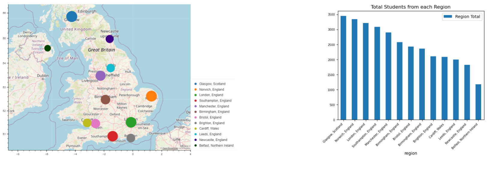
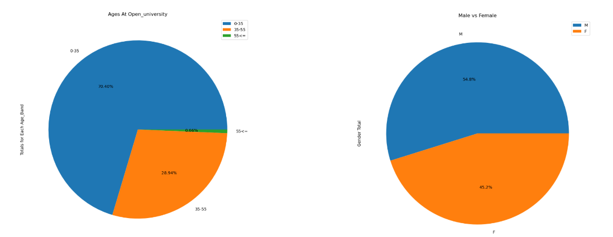
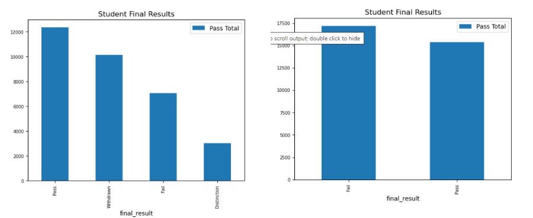
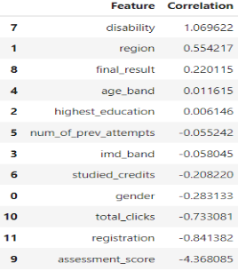
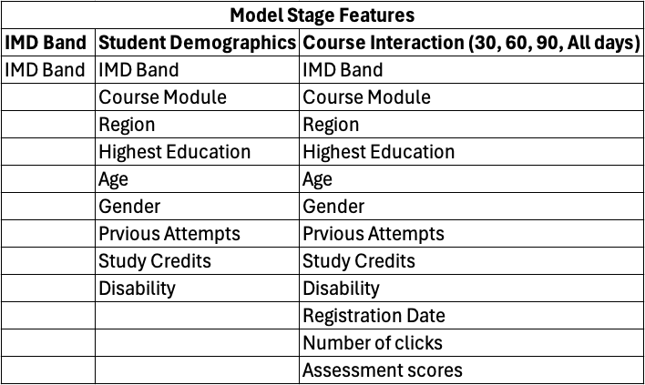
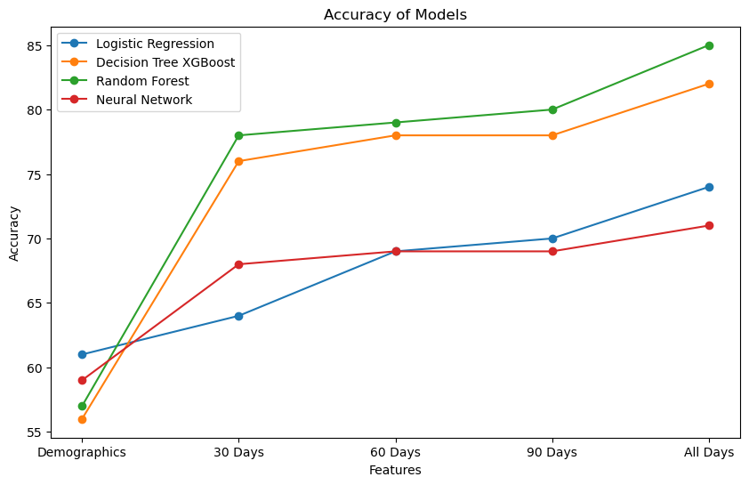
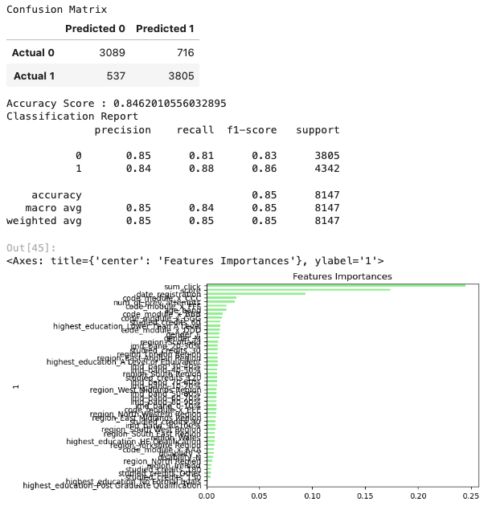
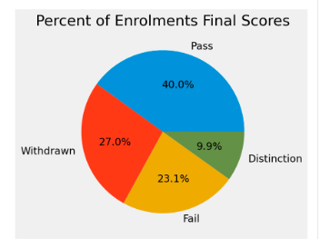
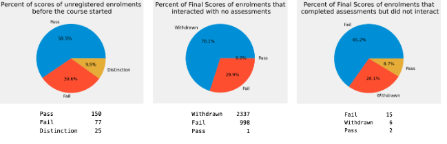
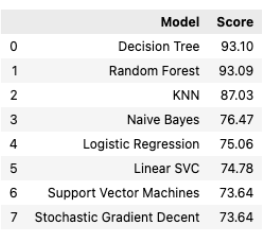

# Data Analytics 2024 - Project 4 - Open University Machine Learning Project
Team Members - Tyson Horsewell, Patric Beaven, Vijay Mani, Hail Nijo

## Overview:
By looking into Open University Data Student Data, we aim to create a model that can be used to answer questions regarding this data and develop relationships

## Aim
Get a general understanding of the data. (Total students, gender ratio, geography of students).
Then use machine learning the following questions:
1. Are there factors that cause some students to be more prone to dropping out than others?
    - Logistic Regression
2. Does IMBD_BAND affect the success of the student?
     - Logistic Regression
     - Decision Tree model
     - Deep Learning Model
     - Neural Network
3. How does Student interaction affect the final score?
     - Decision Tree
     - Random Forest
     - KNN
     - Naive Bayes
     - Logisitc Regression
     - Linear SVC
     - Support Vector Machines
     - Stochastic Gradient Decent

From the models we will create an applicaiton for Open University to use to predict the final result of a student completing a course (Pass or Fail)

## Technologies Used
    - SQLite - Portable database allowing everyone to use the same database small and fast
    - Jupyter Notebooks - Easy to code, test and iterate
    - SQLAlchemy - Connect to SQLite to create and query the database
    - Pandas and Matplotlib - Analysis and Visualization
    - SkLearn and Tensorflow - Machine learning
    - Streamlit & Pandasai - App development
     
## Data Cleanup and Analysis
    - create_db.ipynb was used to turn the 6 csv's that contained data into an SQL Database. From there, the database can be accessed to make pandas dataframes and then analysis can begin.
    - This includes:
    - Merging Dataframes together

1. Basic Data Overview:
   - 32,593 instances of students joining a course. 28, 785 being completely unique students (Unique Student ID's)
   - Students come from 13 different Regions with Scotland being the region with the most students and Ireland being the least
        
   - There are slightly more Male students over Female students. With 17,875 males students vs 14,718 students.
        
   - Passing is the highest "Final Result", however if you combine Passing with Distinction and Withrdrawal with Failing. Then Failing is higher.
        

## Data Questions

1. Are there factors that cause some students to be more prone to dropping out than others?
   - 
   - Disability has the highest positive correlation, that means that when the student has a disability, increases the probability to drop out from the course. Assessment score has the highest negative correlation, which means that when Assessment score increases then probability to drop out of the course decreases.
    - Logistic Regression Model Accuracy score - 81.5

2. Does IMD_BAND affect the success of the student?
    - IMD Band definition: Indices of multiple deprivation (IMD) are widely-used datasets within the UK to classify the relative deprivation of small areas.
    - Target to measure success is whether the student passed or failed
    - Features in each stage of the models:
    
    - Model Accuracy over the stages 
    
    - Conclusion 
        - Multiple features impacted student success
        - Only focusing on IMD Band to predict if a student would pass or fail a course resulted in low accuracy models
        - Top three important features
            - Number of clicks with class material
            - Assessment scores
            - Date of registration
        - Most Successful Model: Random Forest
        

3. How does Student interaction affect the final score?
-   Wanted to find out if the students’ interaction, not their results, would predict their final score.
- 
-   The following columns where used:         
    - Code_module (unique 7)
    - Code_presentation (unique 4)
    - Date_submitted (all values)
    - Date (all values)
    - ID_site (all values)
    - Activity_type (unique 10)
    - Registration (binned to 3)
    - Total_clicks (binned to 6)
    - Final_result (binned to 2)
-  
-  
    - 93%
        - A decision tree is a non-parametric supervised learning algorithm, which is utilized for both classification and regression tasks. It has a hierarchical, tree structure, which consists of a root node, branches, internal nodes and leaf nodes.
        - Random forest is a commonly-used machine learning algorithm. It combines the output of multiple decision trees to reach a single result. Its ease of use and flexibility have fueled its adoption, as it handles both classification and regression problems.
    - 87%
        - KNN tries to predict the correct class for the test data by calculating the distance between the test data and all the training points. Then select the K number of points which is closest to the test data.
    - 75%
        - Gaussian Naive Bayes assumes that each parameter (also called features or predictors) has an independent capacity of predicting the output variable.
        - Logistic regression is a useful model to run early in the workflow.

## Instructions for Web App

    - The web app has interactive tabs called Explore Data and Prediction Calculator. 
    - The first welcome page details an overview of our project and explains the models that were used to answer our questions for the dataset we analysed
    - The Explore Data page allows the user to query the dataset used for analysis through a chatbot. The user can ask the chatbot to plot graphs and answer basic questions questions about the university dataset. 
    [!chatbot](images/chatbot.png)
    - The Prediction Calculator page utilises a Random Forest model, the user can change feature inputs about a student and the model will predict whether the student will pass or fail the course.
    [!calculator](images/calculator.png)

## Limitations and Challenges of Dataset & Dataset & Analysis
Data
- The age of the data is 10 years old 2013-2014 would be better to have more recent data
- The amount of data is only 7 courses over 4 presentations (sessions)
- There are only 27,295 students there would have been many more
- A limited amount of demographic information
- The size of the dataset was about 500 MB larger than github allows

Analysis
- We only had 2 weeks to analyse the data
- Some of the lexicon are harder to understand, or different from Australia, such as education levels

Web Deployment
- Pickle files of models and dataframes too large to store on github

## References & Datasets
https://www.kaggle.com/datasets/mexwell/open-university-learning-analytics
https://docs.streamlit.io/
https://docs.pandas-ai.com/en/latest/
https://scikit-learn.org/stable/

